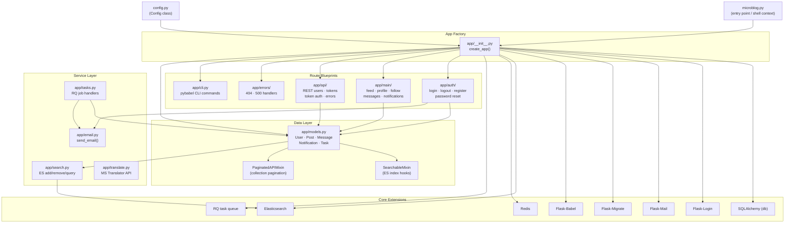

# Architecture Overview

**Microblog** is a Flask-based social networking application following the application factory pattern with a modular blueprint architecture. The application is started from `microblog.py`, which calls `create_app()` in `app/__init__.py` to build the Flask instance, initialize all extensions, register blueprints, and wire up background task infrastructure.

The system is organized into four main blueprint modules — **auth** (registration, login, password reset), **main** (primary feed and profile views), **api** (REST endpoints, token auth), and **errors** (HTTP error handlers) — plus service modules for background jobs, full-text search, email delivery, and translation. Configuration is centralized in `config.py`, loaded from environment variables / `.env`.

The **data layer** lives in `app/models.py`: SQLAlchemy models (`User`, `Post`, `Message`, `Notification`, `Task`) augmented by two mixins — `SearchableMixin` (hooks `before_commit`/`after_commit` to keep Elasticsearch in sync) and `PaginatedAPIMixin` (provides `to_collection_dict` for paginated REST responses). API clients authenticate via bearer tokens stored on the `User` model; browser clients use Flask-Login sessions.

**Background work** (e.g. exporting posts) runs as RQ jobs enqueued into Redis. `app/tasks.py` defines the job handlers, `app/search.py` wraps Elasticsearch, `app/translate.py` calls the Microsoft Translator API, and `app/email.py` dispatches mail through a background thread to avoid blocking request handling.

---

## Module Relationship Diagram

---

## Key Files

| File | Purpose | Notes |
|---|---|---|
| `microblog.py` | Entry point & Flask shell context | Exposes `app`, `db`, `User`, `Post` etc. in `flask shell` |
| `config.py` | Centralised `Config` class | Reads all settings from env / `.env`; SQLite fallback for DB |
| `app/__init__.py` | App factory (`create_app`) | Initialises extensions, registers blueprints, configures logging |
| `app/models.py` | All SQLAlchemy models + mixins | `SearchableMixin` wires ES; `PaginatedAPIMixin` powers REST lists |
| `app/api/users.py` | REST CRUD for users | Token-authenticated; `update_user` enforces ownership |
| `app/api/auth.py` | HTTP Basic + Bearer token auth | `token_auth` used to protect every API endpoint |
| `app/api/tokens.py` | Token issue / revoke | `POST /api/tokens` → token; `DELETE /api/tokens` → revoke |
| `app/auth/routes.py` | Browser auth flows | Login, register, password-reset request, password-reset confirm |
| `app/main/routes.py` | Main app views | Index feed, user profile, follow/unfollow, messages, notifications |
| `app/errors/handlers.py` | Error pages | Custom HTML (browser) and JSON (API) for 404 / 500 |
| `app/email.py` | Email dispatch | Sends via background thread to avoid blocking; uses Flask-Mail |
| `app/tasks.py` | Background RQ jobs | `export_posts` example; updates job progress via RQ meta |
| `app/search.py` | Elasticsearch wrapper | `add_to_index`, `remove_from_index`, `query_index` |
| `app/translate.py` | Translation helper | Calls Microsoft Translator REST API; requires `MS_TRANSLATOR_KEY` |
| `app/cli.py` | CLI blueprint | `flask translate init/update/compile` wrappers around pybabel |
